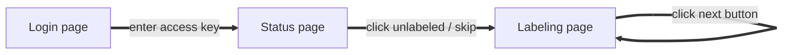

# Image Labeling Program

## TODOS

- [ ] Create Login page, Status page
- [ ] Database setting
- [ ] Database connection

## UX flow

Login page is needed via data storing.  
Maybe skip button is not necessary because we could just click next.  
We should not implement prev button.  
Next button stores data to database.

## Labeling Options

| Property    | Type                            | Value                                 |
| ----------- | ------------------------------- | ------------------------------------- |
| Color       | hex string                      | #000000-#FFFFFF                       |
| Stool Scale | number                          | 1-7 (0 if unselected)                 |
| Stool Props | boolean                         | true/false                            |
| Blood type  | number + string (could be null) | 1-6, 6 needs string (0 if unselected) |
| Memo        | string                          | null or string                        |
| Status      | number                          | 1-4 (default is 1=unlabeled)          |

## Dataset

Use common folder's dataset.

**Image data must be bigger than 512px * 512px.**  
Ratio of width and height of image has threshold `0.8 <= ratio <= 1.25` or something else.

Using python's `resize` function would be easy for pre-processing.

## Database structure

### User key table

User key - index table to get current user's data.

### Labeled data table

Each user has separated table.  
Store image `index`, `color`, `stool scale`, `stool props`, `blood type`, `memo`, `status`.  
Use status filter to give new unlabled image to user.

### Image index table

Index - image table to display image on website.